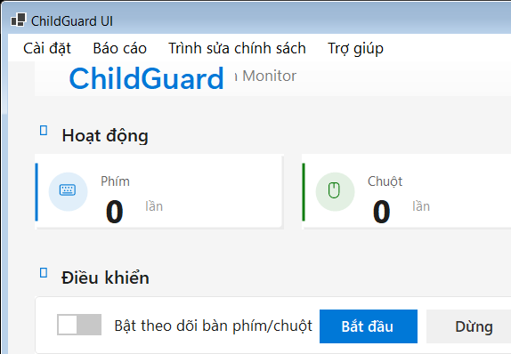
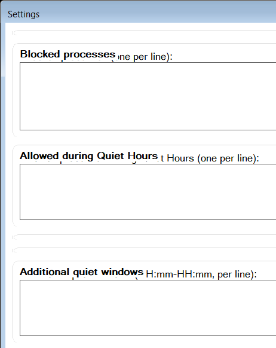
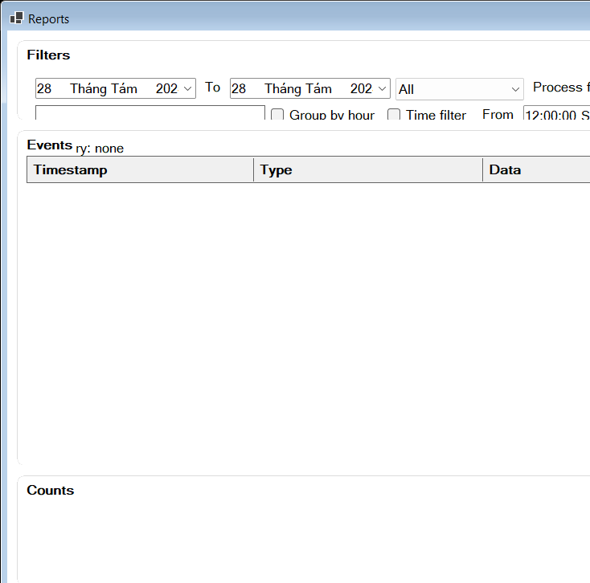

# ChildGuard

[](https://github.com/quangminh1212/ChildGuard/actions/workflows/release.yml)

ChildGuard là ứng dụng Windows (.NET 8, WinForms) giúp giám sát hoạt động và áp dụng chính sách bảo vệ trẻ em trên máy tính. Hỗ trợ Khung giờ yên lặng (Quiet Hours), chặn/cho phép ứng dụng theo lịch, ghi log JSONL, báo cáo trực quan, tự khởi động linh hoạt, và giao diện hiện đại hỗ trợ song ngữ Anh/Việt với theme Sáng/Tối.

> Thông tin tuyển dụng đã tách riêng: xem tại [docs/RECRUITMENT.md](docs/RECRUITMENT.md).

## Tính năng

- Giám sát hoạt động hệ thống
  - Theo dõi bàn phím/chuột (Low-Level hook, có thể bật/tắt trong Cài đặt)
  - Theo dõi cửa sổ đang hoạt động (tên tiến trình/tiêu đề)
  - Ghi nhận tiến trình khởi động/thoát (ProcessStart/ProcessStop)
  - Ghi nhận cắm/rút thiết bị USB
- Chính sách & Khung giờ yên lặng (Quiet Hours)
  - Cấu hình QuietHoursStart/QuietHoursEnd (HH:mm); hỗ trợ nhiều khung giờ bổ sung (AdditionalQuietWindows)
  - Danh sách chặn (BlockedProcesses) và danh sách cho phép trong Quiet Hours (AllowedProcessesDuringQuietHours)
  - Quy tắc nâng cao theo ngày/giờ (PolicyRules) cho phép/chặn theo lịch linh hoạt
  - Thực thi mềm với cảnh báo/đếm ngược; chống spam cảnh báo
- Ghi log & lưu trữ
  - Ghi sự kiện dạng JSON Lines theo ngày (events-YYYYMMDD.jsonl)
  - Dọn dẹp log tự động theo số ngày (LogRetentionDays) và giới hạn dung lượng (LogMaxSizeMB)
  - Tự động tải lại cấu hình khi file thay đổi (debounce)
- Giao diện người dùng (UI)
  - Settings: cấu hình giám sát, Quiet Hours, Blocked/Allowed, lưu trữ log; chọn ngôn ngữ (EN/VI) và Theme (System/Light/Dark)
  - Reports: lọc theo ngày/khoảng thời gian/loại sự kiện/tên tiến trình; Group by hour; xuất CSV và biểu đồ PNG (theme-aware)
  - Policy Editor: chỉnh sửa PolicyRules (JSON) với định dạng đẹp (font monospace)
  - UI hiện đại: bo góc, icon Segoe, dùng accent Windows; hỗ trợ Dark Mode và Sidebar điều hướng (tùy chọn)
- Tự khởi động & cài đặt
  - Installer Inno Setup (self-contained): tự khởi động bằng Scheduled Task (All Users/Current User), fallback HKCU\Run nếu bị chặn
  - Script gỡ tự khởi động; có thể cài như Windows Service (tùy chọn)
- Khác
  - Thư mục dữ liệu mặc định ProgramData; fallback LocalAppData nếu thiếu quyền
  - CI/CD GitHub Actions: build, tạo release, upload installer

## Cài đặt nhanh

Yêu cầu: Windows 10/11, .NET SDK 8 (để build), Inno Setup 6 (nếu build installer)

- Build và chạy UI nhanh (Debug):
```
dotnet build ChildGuard.sln -c Debug
ChildGuard.UI\bin\Debug\net8.0-windows\ChildGuard.UI.exe
```

- Chạy Agent (dev) nếu cần:
```
ChildGuard.Agent\bin\Debug\net8.0-windows\ChildGuard.Agent.exe
```

- Build installer (self-contained) và tạo file cài đặt trong dist/:
```
powershell -ExecutionPolicy Bypass -File scripts\build_installer.ps1 -Configuration Release -Rid win-x64 -Version 1.0.4
```

- Cấu hình tự khởi động Agent sau khi cài đặt (installer thường đã làm; đây là cách thủ công):
```
# All users (yêu cầu quyền phù hợp)
powershell -ExecutionPolicy Bypass -File installer\tools\ensure_agent_autostart.ps1 -Mode allusers -TaskName ChildGuardAgent -ExePath "C:\Program Files\ChildGuard\Agent\ChildGuard.Agent.exe"
# Current user (fallback HKCU Run nếu tạo task bị chặn)
powershell -ExecutionPolicy Bypass -File installer\tools\ensure_agent_autostart.ps1 -Mode current -TaskName ChildGuardAgent -ExePath "C:\Program Files\ChildGuard\Agent\ChildGuard.Agent.exe"
```

- Gỡ tự khởi động (ví dụ trong môi trường dev):
```
powershell -ExecutionPolicy Bypass -File scripts\uninstall_agent_autostart.ps1
```

## Hướng dẫn sử dụng nhanh

1) Mở UI -> Settings để chọn Language (EN/VI) và Theme (System/Light/Dark)
2) Cấu hình Quiet Hours, Blocked/Allowed, Log retention/size; Save -> file config lưu tại ProgramData hoặc LocalAppData
3) Reports -> lọc theo ngày/khoảng giờ/loại sự kiện/tên tiến trình; xuất CSV hoặc PNG
4) Policy Editor -> chỉnh PolicyRules (JSON) theo lịch nâng cao
5) Khởi chạy Agent (hoặc dùng autostart) -> theo dõi hoạt động và thực thi chính sách

## Cấu hình & vị trí dữ liệu

- Config: `C:/ProgramData/ChildGuard/config.json` (ưu tiên) hoặc `%LOCALAPPDATA%/ChildGuard/config.json`
- Logs: `[DataDirectory]/logs/events-YYYYMMDD.jsonl`

## Xử lý sự cố (Troubleshooting)

- Không tạo được Scheduled Task (Access Denied / 0x41306):
  - Thử lại chế độ Current User trong installer hoặc dùng lệnh `ensure_agent_autostart.ps1 -Mode current`
  - Nếu vẫn bị chặn, script sẽ fallback tự động sang HKCU\Run; kiểm tra khóa `HKCU:Software\Microsoft\Windows\CurrentVersion\Run` tên `ChildGuardAgent`
- PowerShell ExecutionPolicy chặn script: dùng `-ExecutionPolicy Bypass` hoặc mở PowerShell với quyền phù hợp
- Inno Setup không có ISCC.exe trong PATH: cài Inno Setup 6 và chạy lại script
- UI không hiện lên phía trước: chạy `scripts/bring_ui_front.ps1`
- Không ghi log hoặc không thấy file config: kiểm tra quyền ghi tại ProgramData/LocalAppData

## Ảnh chụp màn hình

- Giao diện chính:



- Settings:



- Reports:



Tạo nhanh ảnh chụp UI (dev):
```
powershell -ExecutionPolicy Bypass -File scripts\capture_ui_screenshot.ps1
```

## Build/Phát triển

Một số lệnh tiện dụng:
- Khôi phục: `dotnet restore .\ChildGuard.sln`
- Build: `dotnet build .\ChildGuard.sln -c Release -v minimal`
- Chạy UI (dev): `dotnet run --project .\ChildGuard.UI\ChildGuard.UI.csproj`
- Chạy Agent (dev): `dotnet run --project .\ChildGuard.Agent\ChildGuard.Agent.csproj`
- Test: `dotnet test .\ChildGuard.sln -c Release`

## Giấy phép

Dự án sử dụng giấy phép MIT. Xem chi tiết tại file [LICENSE](LICENSE).
